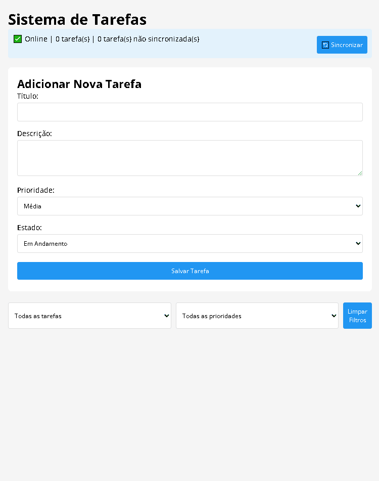

# CRUD de Tarefas – JavaScript Vanilla

Um aplicativo de **gerenciamento de tarefas (CRUD)** desenvolvido em **JavaScript puro**, com persistência em `localStorage`, filtros, edição, remoção e simulação de sincronização com servidor.

Projeto focado em **lógica, estado da aplicação e manipulação do DOM**, sem frameworks.

---

## Funcionalidades

- Criar tarefas com:
  - Título
  - Descrição
  - Status
  - Prioridade
- Editar tarefas existentes
- Remover tarefas com confirmação
- Persistência de dados usando `localStorage`
- Simulação de sincronização com servidor (API fake)
- Filtros por:
  - Status
  - Prioridade
- Contador de tarefas totais e não sincronizadas
- Cancelamento de edição

---

## Tecnologias utilizadas

- **HTML5**
- **CSS3**
- **JavaScript (Vanilla JS)**
  - Manipulação do DOM
  - Eventos
  - `localStorage`
  - Promises
  - Event Delegation

---

## Conceitos aplicados

- CRUD completo (Create, Read, Update, Delete)
- Gerenciamento de estado da aplicação
- Validação de formulários
- Programação assíncrona (`Promise`, `setTimeout`)
- Separação de responsabilidades
- Simulação de backend offline
- UX básico com feedback ao usuário

---

## 📂 Estrutura do projeto

```
crudtarefas
┣ assets
┃ ┣ js
┃ ┃ ┗ main.js
┃ ┗ css
┃   ┗ style.css
┣  index.html
┣  README.md
┣  .gitattributes
┗  .LICENSE

```

---

## Preview

<p align="center">
  
</p>

---

## Objetivo do projeto

Este projeto foi desenvolvido com foco em **praticar lógica de programação**, entender o **fluxo de um CRUD real** e consolidar conceitos fundamentais do JavaScript antes do uso de frameworks.

---

## Autor

**Gustavo Savi**  
Em transição de carreira para Desenvolvimento Web

🔗 [LinkedIn](https://www.linkedin.com/in/gustavo-savi)  
🔗 [GitHub](https://github.com/gutosavi)

---

## Próximos passos (ideias de evolução)

- Marcar tarefas como sincronizadas
- Integração com API real
- Melhorar feedback visual (toasts, mensagens inline)
- Testes básicos
- Versão futura com framework (React / Vue)

---

⭐ Se curtiu o projeto, deixa uma estrela!
