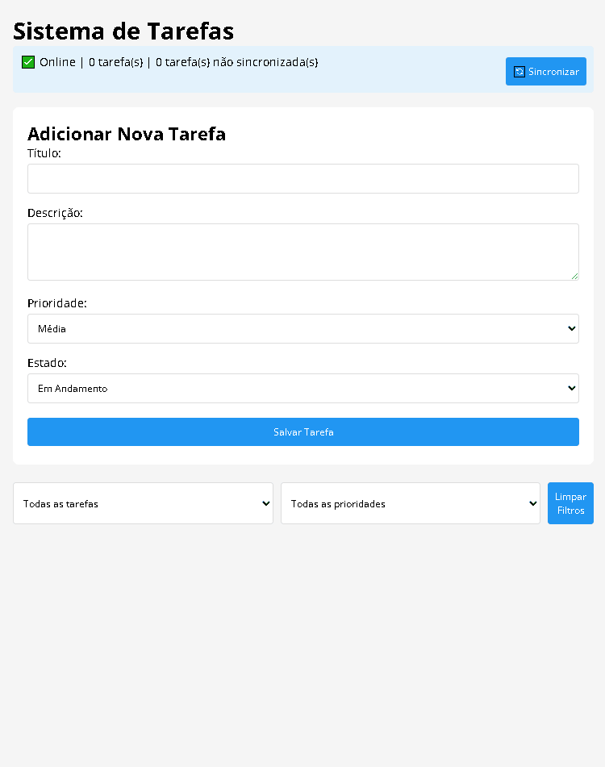

# CRUD de Tarefas – JavaScript Vanilla + API

Um aplicativo de gerenciamento de tarefas (CRUD) desenvolvido em **JavaScript puro**, com:

- Persistência em `localStorage`
- Filtros dinâmicos
- Edição e remoção
- Controle de estado da aplicação
- Integração com API externa

Projeto focado em **lógica de programação, manipulação do DOM e JavaScript assíncrono**, sem uso de frameworks.

---

## Funcionalidades

### CRUD Completo

- Criar tarefas com:
  - Título
  - Descrição
  - Status
  - Prioridade
- Editar tarefas existentes
- Remover tarefas com confirmação

---

### Persistência Local

- Armazenamento via `localStorage`
- Recuperação automática ao recarregar a página

### Integração com API (Estudo de JS Assíncrono)

O projeto consome a API pública:

https://jsonplaceholder.typicode.com/todos

Implementações realizadas:

- `fetch()` para requisições HTTP
- `async/await`
- Tratamento de erros com `try/catch`
- Conversão de dados da API para o modelo da aplicação
- Controle de sincronização (`sincronizado: true/false`)
- Simulação de falha de servidor com `setTimeout`

Fluxo implementado:

1. Carregamento inicial de tarefas da API
2. Criação de tarefas locais
3. Tentativa de sincronização manual
4. Controle de tarefas não sincronizadas
5. Feedback visual para o usuário

---

## Filtros e Estado

- Filtro por status
- Filtro por prioridade
- Contador de tarefas totais
- Contador de tarefas não sincronizadas
- Cancelamento de edição
- Event Delegation para manipulação dinâmica

---

## Conceitos Aplicados

- CRUD completo (Create, Read, Update, Delete)
- Gerenciamento de estado da aplicação
- Manipulação do DOM
- Validação de formulários
- JavaScript Assíncrono:
  - Promises
  - `async/await`
  - `fetch API`
  - Tratamento de erros
- Persistência com `localStorage`
- Simulação de backend offline
- Separação de responsabilidades
- Arquitetura organizada em funções

---

## Tecnologias utilizadas

- **HTML5**
- **CSS3**
- **JavaScript (Vanilla JS)**
  - Manipulação do DOM
  - Eventos
  - `localStorage`
  - Promises
  - Event Delegation

---

## Estrutura do projeto

```
crudtarefas
┣ assets
┃ ┣ js
┃ ┃ ┗ main.js
┃ ┗ css
┃   ┗ style.css
┣  index.html
┣  README.md
┣  .gitattributes
┗  .LICENSE

```

---

## Preview

<p align="center">
  
</p>

---

## Objetivo do Projeto

Este projeto foi desenvolvido com foco em:

- Consolidar fundamentos de JavaScript
- Praticar fluxo completo de CRUD
- Entender comunicação com API
- Trabalhar programação assíncrona na prática
- Simular cenários reais de sincronização online/offline

Ele representa uma evolução natural antes da migração para frameworks como React.

---

## Autor

**Gustavo Savi**  
Desenvolvedor Frontend em evolução

🔗 [LinkedIn](https://www.linkedin.com/in/gustavo-savi)  
🔗 [GitHub](https://github.com/gutosavi)

---

## Próximos passos (ideias de evolução)

- Sincronização automática em background
- Melhorar feedback visual (toasts)
- Refatorar para arquitetura modular
- Adicionar loading states
- Implementar testes básicos
- Criar versão em React

---

⭐ Se curtiu o projeto, deixa uma estrela!
